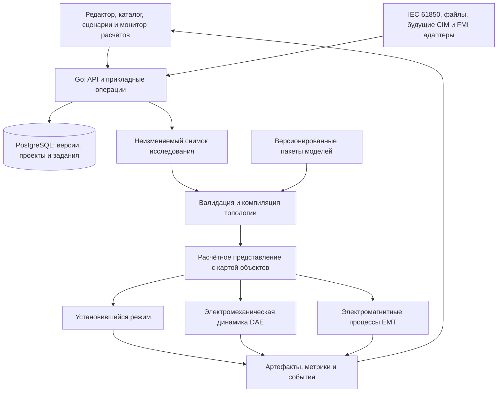

# Enersy: анализ проекта и целевая архитектура

Дата: 2026-09-29. Основание: текущее рабочее дерево, включая незакоммиченные файлы. Это статический анализ, а не отчёт об успешном запуске или численной верификации. Julia, Go и Cargo не обнаружены в PATH этой сессии; расчётные тесты не запускались. Существующие изменения приложения сохранены.

Связанные документы: [правила разработки](CODING_RULES.md), [план реализации](../TODO.md).

Обновление 2026-09-30: выполненные исправления, реально запущенные тесты и оставшиеся ограничения описаны в [отчёте проверки реализации](IMPLEMENTATION_REVIEW_2026_09_30.md). Ниже сохранён первоначальный статический анализ; его замечания не являются утверждением, что все дефекты остаются в текущем коде.

## 1. Вывод

Enersy уже содержит полезный прототип редактора и справочника. Превращать его в открытую универсальную инженерную платформу следует через общее описание оборудования и несколько проверяемых расчётных представлений. Текущее ядро нельзя считать подтверждённым средством расчёта режимов: найдены ошибки формирования уравнений, единиц и топологии.

«Заменить все программы» — долгосрочное направление, которое проверяется по конкретным сценариям, классам моделей, точности, импорту данных и масштабу. Универсальность не означает один решатель для всех физических процессов. Для каждого поддержанного сценария нужны воспроизводимый пример, ограничения применимости и независимый эталон. Наличие символа в редакторе не доказывает наличие физической модели.

## 2. Что уже существует

| Область | Наблюдение по коду | Граница возможностей |
| --- | --- | --- |
| Интерфейс | React, TypeScript, SVG-редактор, панели свойств, выбор заводской модели | Нет полноценного конструктора математических моделей и рабочего пространства исследования |
| Каталог | 13 типов в `database/init.sql`, шаблоны, `equipment_models`, `equipment_model_params` | Заводские параметры хранятся строками; нет версий, происхождения и подтверждения характеристик |
| API | Go, PostgreSQL, CRUD схем и компонентов, чтение каталога, health/readiness, логирование | Один большой `main.go`; расчёт синхронно проксируется в Julia |
| Расчёты | Julia: заготовки Ньютона, фазных координат и прямого решения | Нет проверенного полного AC power flow, динамики, машинных состояний и управления заданием |
| Rust | Геометрия, связность, проверка типов соединений, unit-тесты | Это библиотека вспомогательных функций, а не физическое ядро; вызовы её функций в `frontend/src` поиском не обнаружены |
| Хранение | Таблицы узлов, результатов и ветвей объявлены | `handleCalculate` не записывает результаты в эти таблицы |
| Проверки | Go-тесты обработчиков, frontend-тесты API с mock, Rust-тесты, CI, k6 | Нет численного набора тестов Julia; нагрузочный сценарий проверяет три простых GET-запроса |
| Документация | README, CONTRIBUTING, журнал AGENTS | Журнал устарел: `ModelSelectModal.tsx` и две пары миграций уже есть |

## 3. Критические находки и последствия

Ссылки ниже указывают на исходные файлы; имена функций и диапазоны строк относятся к состоянию на дату анализа.

| ID | Приоритет | Основание | Последствие и требуемое действие |
| --- | --- | --- | --- |
| A01 | P0 | [main.jl](../backend-julia/main.jl), `calculate_ees_mode`, строки 539–585 | Для Ньютона генераторы становятся PV, но Slack нигде не назначается. `newton_raphson` требует Slack и возвращает ошибку. Ввести явную политику опорного узла для каждого питаемого острова. |
| A02 | P0 | `newton_raphson`, строки 37, 68–89, 151–182 | Размер Якобиана `npv + 2*npq`, но добавлены ещё `npv` невязок напряжения и строки PV; затем читаются отсутствующие компоненты приращения. Зафиксировать согласованный набор неизвестных и уравнений, проверить производные. |
| A03 | P0 | `calculate_ees_mode`, `build_admittance_matrix`, строки 189–229, 531–585 | Узлами становятся только шины, генераторы и нагрузки. Соединения с другими компонентами пропускаются, если их ID нет в узлах. Обычная цепь «генератор — выключатель — шина — линия» не компилируется в правильную сеть. Нужна топология терминалов и электрических узлов. |
| A04 | P0 | `build_admittance_matrix`, `direct_solve`, строки 197–220, 239–278 | Вставляются произвольные проводимости; прямой метод вообще не использует соединения при построении Y. Возможен `success=true` для физически другой задачи. Удалить неявные подстановки, неподдержанные задачи отклонять. |
| A05 | P0 | `calculate_ees_mode`, `newton_raphson`, вывод результатов; [SQL](../database/init.sql) | Шаблоны задают кВ/МВт/Ом, ветви расчёта используют разные преобразования, результат Ньютона преобразуется как фазное напряжение в вольтах; генерация и нагрузка получают одинаковый отрицательный знак. Ввести контракт SI/p.u., знаков и базисов. |
| A06 | P0 | `phase_coordinates_solve`, строки 376–398, 452–456, 478–485; `calculate_ees_mode`, строки 576–582 | Невязка вычитает мощность из тока `J_ph`; Якобиан местами индексирует Y через локальные `i,j` вместо `gi,gj`. Пофазные параметры передаются числами, затем обрабатываются через `parse`. Этот режим требует исправления и отдельной верификации. |
| A07 | P0 | `handler`, строки 748–755; функции принимают `Vector{Any}` | Контракт JSON3-контейнеров и строгих сигнатур не нормализован. Вынести типизированное декодирование и проверить реальный HTTP-запрос. Это риск исполнения, не подтверждённый запуском. |
| A08 | P0 | `HTTP.serve` перед `parse_matrix`/`parse_vector`, строки 781–819 | При блокирующем запуске сервер начинает обслуживать `/solve` до выполнения последующих определений. Отделить определение модуля от точки запуска; проверить оба маршрута. |
| A09 | P0 | [CanvasToolbar](../frontend/src/components/ees/panels/CanvasToolbar.tsx), `GROUP_METHODS`; Julia, строки 517–522 | UI предлагает прямой фазный метод и симметричные составляющие, явно не реализованные на сервере. Выдавать список возможностей от backend с состояниями experimental/validated/unsupported. |
| A10 | P0 | [useSchemeData](../frontend/src/components/ees/hooks/useSchemeData.ts), `addComponent`; [ModelSelectModal](../frontend/src/components/ees/panels/ModelSelectModal.tsx), `handleConfirm` | Создание и параметры — отдельные запросы, ошибки параметров подавляются; ошибка загрузки выбранной модели превращается в добавление без неё. Нужна одна транзакция и явная ошибка. |
| A11 | P0 | [main.go](../backend-go/main.go), `runMigrations`, `initDB`; [Dockerfile](../backend-go/Dockerfile) | Миграции ищутся в `../database/migrations`, но в runtime-образ копируется только бинарник. При ошибке миграции API продолжает запуск. Упаковать миграции, проверять версию и запрещать readiness при несовместимости. |
| A12 | P0 | `handleCalculate`/`handleJuliaSolve`, строки 981–1006 и далее | HTTP-вызов с лимитом 25 секунд, без `r.Context()`; HTTP-статус Julia не переносится клиенту. Нет job ID, отмены, прогресса и сохранённого снимка. Сначала исправить транспорт, затем ввести задания. |
| A13 | P1 | [editor-utils](../frontend/src/components/ees/editor-utils.ts), `getPorts`; [lib.rs](../rust-wasm/src/lib.rs), `validate_connection`; Julia | Типы и правила разбросаны по условным ветвям разных языков. Новый SQL-тип не добавляет уравнения и корректные порты. Нужны версии описателей и независимые реестры моделей/символов. |
| A14 | P1 | [SchemeEditor](../frontend/src/components/ees/SchemeEditor.tsx), `renderConnection`, `components.map`; [useCanvasInteraction](../frontend/src/components/ees/hooks/useCanvasInteraction.ts) | Рисуются все элементы, поиск компонентов повторяется для связей; обработка порта не учитывает поворот так же, как отрисовка. Нужны общий transform, индексы и отсечение невидимых объектов. |
| A15 | P1 | `handleCalculate`: запрос параметров внутри цикла компонентов; `useSchemeData`: запрос шаблона на каждый экземпляр | N+1 запросы и загрузка всей схемы ограничивают масштаб. Пакетное чтение, кэш по версии типа, измерения на больших схемах. |
| A16 | P0 | `handleConnections`; `scheme_connections` в SQL | Внешние ключи не гарантируют, что оба компонента принадлежат указанной схеме; существование порта и физическая совместимость не проверяются. Нужны серверные инварианты и ограничения БД. |
| A17 | P1 | [ResultsModal](../frontend/src/components/ees/panels/ResultsModal.tsx), `dangerouslySetInnerHTML`; `SchemeEditor`, сборка HTML | Структурированные результаты превращаются в HTML. Заменить на типизированные React-компоненты и унифицированные значения с единицами. |
| A18 | P1 | [CI](../.github/workflows/ci.yml), [package.json](../frontend/package.json), [Project.toml](../backend-julia/Project.toml) | Нет Julia job и отдельного `tsc --noEmit`, сборка Vite не является проверкой типов. Нет frontend lockfile и Julia Manifest в просмотренном дереве; инструменты местами плавающие. Нужна воспроизводимая сборка. |
| A19 | P1 | [README](../README.md), раздел лицензии, корень репозитория | README заявляет MIT, отдельный LICENSE не найден. Добавить файл с подтверждёнными правообладателем данными; отдельно учесть права на DXF, символы и каталожные данные. |

Эти находки не означают, что все остальные участки проверены или корректны. Численные результаты, производительность и совместимость развёртывания ещё нужно подтвердить тестами.

## 4. Архитектура развития

Сохранить React/TypeScript, Go, Julia и PostgreSQL. Rust использовать для подтверждённых узких мест, общих алгоритмов топологии и адаптера IEC 61850. Полная перепись на новый язык сейчас увеличит риск потери поведения и не исправит постановку физических задач.

Это целевая схема модулей, а не требование немедленно создавать отдельный сервис для каждого блока. Первый worker может быть один; его расчётное ядро должно запускаться и без HTTP. Хранение крупных результатов скрывается за интерфейсом артефактов: сначала файлы для локального использования, затем объектное хранилище при необходимости. PostgreSQL хранит метаданные и индексы.

### Данные и расширяемость

Разделить `EquipmentType` (вид оборудования), `CatalogEntryRevision` (паспорт конкретного изделия), `ModelDefinitionVersion` (уравнения и область применимости), `EquipmentInstance` (устройство в проекте), `ModelBinding` (выбранное расчётное представление), `DiagramView` (изображение). У одного устройства может быть несколько представлений для AC, RMS и EMT. Справочник не должен менять прошлые проекты при обновлении карточки.

Физический граф строится по `Terminal → ConnectivityNode`; электрический узел расчёта возникает после обработки состояния коммутации. Внешний терминал может описывать фазы и нейтраль. Механические, тепловые и сигнальные порты имеют собственные типы. Координаты рисунка не задают электрическую связь. Сеть допускает кольца, параллельные ветви и несколько островов.

Новый заводской вариант добавляется через карточку. Новая параметризованная модель — через версионированный описатель и библиотеку уравнений. Новый физический закон или алгоритм может требовать кода расширения и проверки. Обещать добавление любой физики только заполнением формы нельзя.

### Расчётные уровни

| Уровень | Задачи и физика | Условия готовности |
| --- | --- | --- |
| AC/DC steady state | AC с PQ/PV/опорными узлами, ограничения Q, DC-сети; линейное DC-приближение AC обозначать отдельно | Балансы, потоки, потери, острова, проверенные базисы |
| Несимметрия и КЗ | Фазные координаты, нейтраль, заземление, последовательности, взаимные связи | Проверки симметричного предела и известного аварийного режима; методика КЗ с указанной редакцией при нормативном расчёте |
| RMS dynamics | Машины, регуляторы, частота, угол, возбуждение, устойчивость, дискретные события | Согласованная инициализация DAE из установившегося режима, эталонные возмущения |
| EMT | Мгновенные abc/DC величины, потокосцепления, RLC, коммутация, преобразователи, насыщение | Проверки шага, энергии, времён событий; собственные ограничения по масштабу |
| Связанная физика | Вал, механическая нагрузка, потери и нагрев; позднее внешние полевые модели | Явные границы и обмен энергией; пространственные поля и FEM не обещаются обычной схемной моделью |
| Исследования | N−1, продолжение режима, гармоники, малые колебания, оценивание состояния, OPF, оптимизация, идентификация | Отдельные постановки, допуски, тесты и отчёты о покрытии |

Для динамики рассмотреть SciML/ModelingToolkit через короткие прототипы на DAE и событийной модели. Документация подтверждает средства согласованной инициализации и пошагового интегрирования, но не готовность Enersy и не автоматическую пригодность любой библиотеки для больших сетей. Решение о зависимостях принять после численных и ресурсных испытаний. См. [DAE initialization](https://docs.sciml.ai/ModelingToolkit/stable/tutorials/initialization/) и [Integrator Interface](https://docs.sciml.ai/DiffEqDocs/stable/basics/integrator/).

### Управление исследованием

Пользователь выбирает ревизию схемы, режим моделирования, модели, алгоритм, допуски, начальное состояние, события и наблюдаемые величины. Задание получает ID и неизменяемый снимок. UI показывает этап подготовки, невязку/итерацию или модельное время, события, ресурсы и диагностику. Отмена, пауза и один шаг выполняются worker на безопасной границе. Повторный запуск и продолжение из контрольной точки имеют разные контракты.

### Графический интерфейс

Единое рабочее пространство: дерево объектов и каталог, несколько представлений схемы, инспектор параметров, редактор сценариев, журнал и временные графики. Нужны сохраняемые раскладки, темы, масштабирование, слои, подстанции и подсхемы, поиск, массовые операции и undo/redo. Векторный экспорт должен оставаться читаемым независимо от экранного renderer.

Сначала измерить и улучшить текущий SVG через индексы, виртуализацию панелей и viewport culling. Canvas/WebGL/WebGPU вводить за интерфейсом renderer по результатам теста; не делать GPU обязательным для открытия проекта. Для canvas предусмотреть доступное табличное/деревовидное представление. Целевой ориентир доступности — [WCAG 2.2](https://www.w3.org/TR/WCAG22/), без заявления о достигнутом соответствии.

### Многопользовательская работа и независимые сессии

Дополнение к целевой архитектуре от 2026-10-03 по требованию пользователя. Это план развития, а не описание реализованной авторизации. Правила и критерии приёмки закреплены в разделе 15 [CODING_RULES.md](CODING_RULES.md) и задачах USER-01/02/03 в [TODO.md](../TODO.md).

Разделить `User`, отзываемую `AuthSession`, `Project` с участниками и ролями, а также `WorkspaceContext` отдельной вкладки. Общие схемы и версии моделей принадлежат проекту; выбор схемы, выделение, раскладка и черновик принадлежат рабочему контексту. Вход одного пользователя с нескольких устройств и вкладок не должен смешивать эти состояния. Отзыв одной сессии прекращает её доступ независимо от остальных сессий.

Проверять доступ в Go API при каждой операции над проектом и вложенными объектами, включая поиск, каталог, экспорт, подписки и артефакты. Область доступа должна учитываться в запросах к PostgreSQL и ключах кэшей. Ревизии защищают совместные правки от потери, но не подтверждают право доступа. Совместное редактирование общего проекта допускается только для его участников с соответствующей ролью.

Расчётное задание получает проект, автора и неизменяемый снимок входных данных. Docker workers берут задания из очереди и не используют глобальную активную схему или состояние браузера. Права на команды и результаты проверяются отдельно от наличия ID задания; ограничения ресурсов учитывают пользователя и проект. Закрытие вкладки не отменяет расчёт. Такая структура сохраняет Docker/Compose как основу запуска и допускает несколько API/worker-процессов без привязки сессии к одному процессу.

## 5. IEC 61850 и будущий opencim

Просмотрены `C:/project/open-libiec61850/README.md`, `Cargo.toml`, документация bindings/FFI и `crates/openiec61850-server/src/lib.rs`. Это собственная Rust-библиотека с Rust API и C ABI; README описывает ограниченные профили MMS, SCL, reports, controls, GOOSE/SV и TLS и прямо обозначает pre-alpha. Проверки и полнота реализации в рамках этой задачи не воспроизводились.

Предпочтительный будущий путь — отдельный Rust-адаптер, связанный с зафиксированной версией библиотеки. Он переводит внешний идентификатор в доменный ID, сохраняет качество и временную метку, согласует модельное и реальное время и передаёт события через контракт. Абсолютный локальный путь не становится зависимостью сборки. C ABI нужен только для обоснованного межъязыкового потребителя с соблюдением владения и времени жизни.

Первый сценарий: автономное воспроизведение записанных измерений и событий, затем виртуальное IED на loopback, затем отдельное испытание реального оборудования. Физический интегратор не должен блокироваться на сетевом чтении. HIL и гарантированное реальное время требуют отдельного стенда и бюджетов задержки. Управление расчётом и команда реальному выключателю — разные операции с разными полномочиями.

Для opencim зарезервировать только расширяемые внешние идентификаторы и интерфейс импорта/экспорта. Сейчас не создавать зависимость, обязательные CIM-классы или библиотеку-заглушку. Будущая интеграция должна объявлять профиль, версию, потери при преобразовании и проверять round-trip. SCL, CIM и внутренняя математическая модель не взаимозаменяемы.

## 6. Источники для проектирования

Внешние материалы проверены 2026-09-29. Это обоснования отдельных решений, а не доказательство корректности текущего кода.

- [MATPOWER: AC Power Flow](https://matpower.app/manual/matpower/ACPowerFlow.html): постановка PQ/PV/reference и ограничения Q; использовать как независимый расчётный ориентир с одинаковыми настройками.
- [Modelica Standard Library: Machines](https://doc.modelica.org/Modelica%204.0.0/Resources/helpDymola/Modelica_Electrical_Machines_BasicMachines.html): пример разделения семейств машин и их компонентов; конкретная версия и допущения модели должны фиксироваться при сравнении.
- [FMI 3.0.2](https://fmi-standard.org/docs/3.0.2/): различие Model Exchange и Co-Simulation; возможный последующий адаптер, не ядро первой очереди.
- [OpenAPI](https://spec.openapis.org/oas/latest.html) и [JSON Schema 2020-12](https://json-schema.org/draft/2020-12): машинно проверяемые контракты; версия фиксируется в проекте после проверки поддержки генераторами.

## 7. Что изменено этой задачей

Добавлены этот анализ, обязательные правила и поэтапный TODO; обновлена навигация в AGENTS, CONTRIBUTING и README. Реализация решателей, API, UI, БД и внешней библиотеки не изменялась. Закрытие найденных дефектов и подтверждение инженерной пригодности вынесены в отдельные задачи с критериями приёмки.
